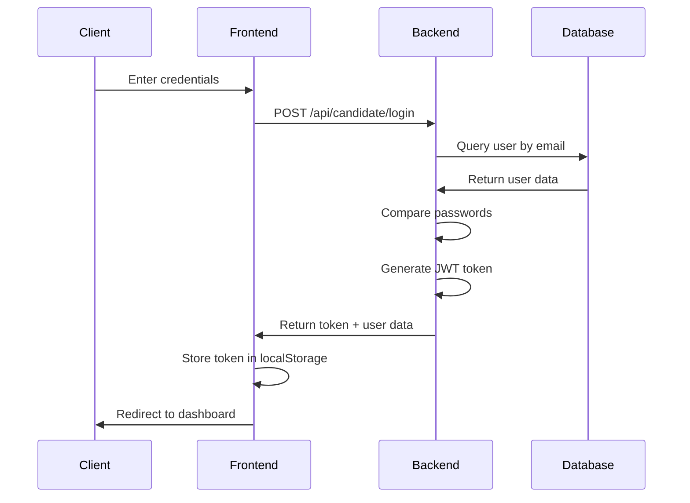
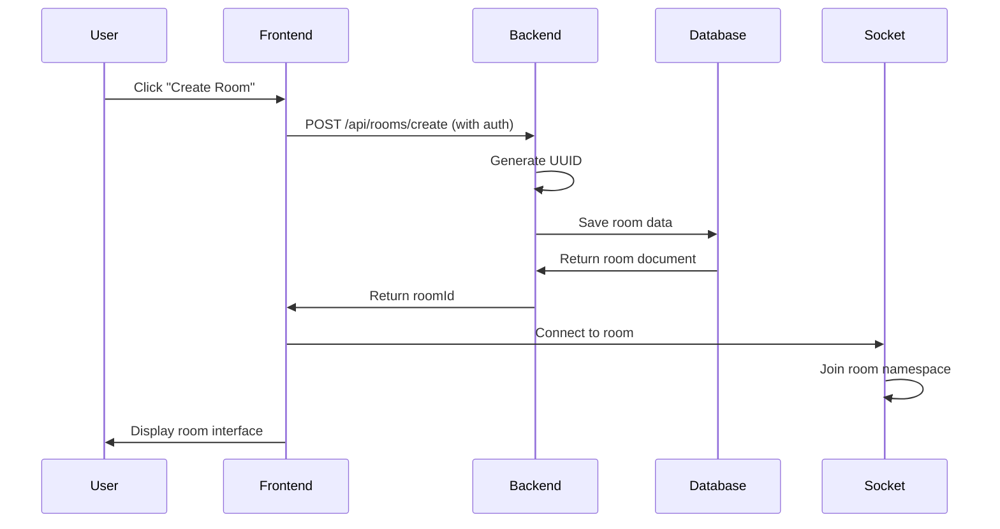
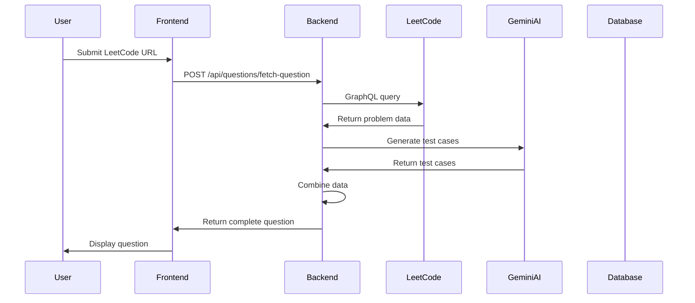
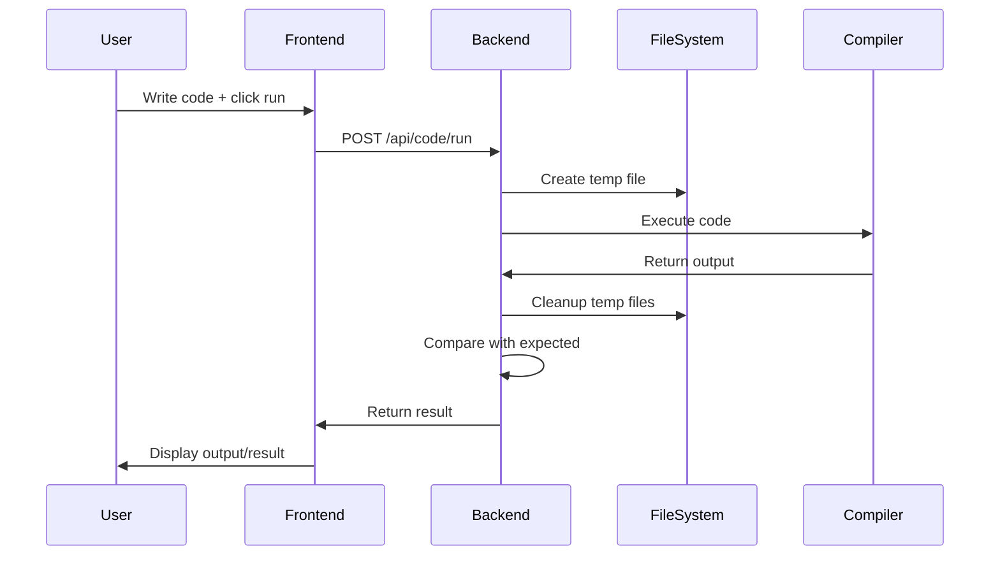

# 🚀 JobSphere Application - Complete Codeflow Documentation

## 📋 Table of Contents
1. [Architecture Overview](#architecture-overview)
2. [Application Startup Flow](#application-startup-flow)
3. [Backend Deep Dive](#backend-deep-dive)
4. [Frontend Deep Dive](#frontend-deep-dive)
5. [Data Flow Patterns](#data-flow-patterns)
6. [Feature-by-Feature Breakdown](#feature-by-feature-breakdown)
7. [Authentication Flow](#authentication-flow)
8. [Socket Communication](#socket-communication)
9. [Error Handling](#error-handling)
10. [Development Guidelines](#development-guidelines)

---

## 🏗️ Architecture Overview

JobSphere is a **full-stack interview platform** built with:

### **Tech Stack:**
- **Backend**: Node.js + Express.js
- **Database**: MongoDB with Mongoose ODM
- **Frontend**: React + Vite + TailwindCSS
- **Real-time Communication**: Socket.IO
- **Authentication**: JWT (JSON Web Tokens)
- **Code Execution**: Multi-language support (Python, JavaScript, C++, Java)
- **AI Integration**: Google Gemini for test case generation
- **External APIs**: LeetCode GraphQL API

### **Architecture Pattern:**
```
Frontend (React) ↔ Backend (Express/Socket.IO) ↔ Database (MongoDB)
                          ↕
                  External Services (LeetCode, Gemini AI)
```

---

## 🚀 Application Startup Flow

### **Backend Startup Process (`index.js`):**

```javascript
// 1. DEPENDENCIES LOADING
const express = require("express");
const http = require("http");
const cors = require("cors");
const mongoose = require("mongoose");
const { Server } = require("socket.io");
```

**What happens here:**
- Node.js loads all required dependencies
- Express framework for HTTP server
- HTTP module for creating server instance
- CORS for cross-origin requests
- Mongoose for MongoDB connection
- Socket.IO for real-time communication

```javascript
// 2. ROUTE IMPORTS
const authRoutes = require("./routes/authRoutes");
const roomRoutes = require("./routes/roomRoutes");
const QuestionFetchRouter = require("./routes/QuestionFetchRouter");
const socketHandler = require("./sockets/socketHandler");
const assessmentRoutes = require("./routes/AssessmentRoutes");
const interviewerRoutes = require("./routes/interviewerRoutes");
const candidateRoutes = require("./routes/candidateRoutes");
const codeRoutes = require("./routes/codeRoutes");
```

**What happens here:**
- All route handlers are imported
- Each route file contains specific API endpoints
- Socket handler for real-time features

```javascript
// 3. ENVIRONMENT CONFIGURATION
require("dotenv").config();
console.log(process.env.JWT_SECRET);
```

**What happens here:**
- Environment variables loaded from `.env` file
- JWT_SECRET, MONGO_URI, GEMINI_API_KEY, etc.
- Security credentials are kept separate from code

```javascript
// 4. SERVER SETUP
const app = express();
const server = http.createServer(app);
const io = new Server(server, {
  cors: { origin: "*", methods: ["GET", "POST"] }
});
```

**What happens here:**
- Express app instance created
- HTTP server wraps Express app
- Socket.IO server attached to HTTP server
- CORS configured for Socket.IO

```javascript
// 5. MIDDLEWARE CONFIGURATION
app.use(cors());
app.use(express.json());
app.use(express.urlencoded({ extended: true }));
app.use(bodyParser.json());
app.use(bodyParser.urlencoded({ extended: true }));
```

**What happens here:**
- CORS middleware enables cross-origin requests
- JSON parsing middleware for request bodies
- URL-encoded data parsing
- Body-parser for additional parsing options

```javascript
// 6. ROUTE REGISTRATION
app.use("/api/rooms", roomRoutes);
app.use("/api/questions", QuestionFetchRouter);
app.use("/api/assessments", assessmentRoutes);
app.use("/api/code", codeRoutes);
app.use("/api/interviewer", interviewerRoutes);
app.use("/api/candidate", candidateRoutes);
app.use("/api/auth", authRoutes);
```

**What happens here:**
- Each route module is mounted to specific URL prefixes
- All API endpoints become available under `/api/*`

```javascript
// 7. SOCKET.IO INTEGRATION
io.on("connection", (socket) => socketHandler(io, socket));
```

**What happens here:**
- Socket.IO listens for new connections
- Each connection gets a unique socket instance
- Socket handler manages real-time events

```javascript
// 8. DATABASE CONNECTION
mongoose.connect(process.env.MONGO_URI)
.then(() => console.log("MongoDB connected"))
.catch(err => console.log(err));
```

**What happens here:**
- Mongoose connects to MongoDB database
- Connection string from environment variables
- Success/error logging

```javascript
// 9. SERVER STARTUP
const PORT = process.env.PORT || 5000;
server.listen(PORT, () => console.log(`Server running on port ${PORT}`));
```

**What happens here:**
- Server starts listening on specified port
- Default port 5000 if not specified in environment
- Server is now ready to accept requests

---

## 🔧 Backend Deep Dive

### **1. Models Layer (Database Schemas)**

#### **Candidate Model (`models/Candidate.js`)**
```javascript
const CandidateSchema = new mongoose.Schema({
  name: { type: String, required: true },
  email: { type: String, required: true, unique: true, lowercase: true },
  password: { type: String, required: true, minlength: 6 },
  assessments: [{ type: mongoose.Schema.Types.ObjectId, ref: "Assessment" }],
  profile: {
    phone: String,
    skills: [String],
    experience: Number,
    resume: String
  }
}, { timestamps: true });
```

**Functionality:**
- **Pre-save Hook**: Automatically hashes passwords using bcrypt
- **comparePassword Method**: Compares plain text with hashed password
- **Relationships**: References to Assessment documents
- **Validation**: Email uniqueness, password minimum length
- **Timestamps**: Automatic createdAt and updatedAt fields

#### **Interviewer Model (`models/Interviewer.js`)**
```javascript
const InterviewerSchema = new mongoose.Schema({
  name: { type: String, required: true },
  email: { type: String, required: true, unique: true, lowercase: true },
  password: { type: String, required: true, minlength: 6 },
  assessments: [{ type: mongoose.Schema.Types.ObjectId, ref: "Assessment" }]
}, { timestamps: true });
```

**Functionality:**
- Similar to Candidate but without profile fields
- Manages assessments created by interviewer
- Same authentication mechanisms

#### **Room Model (`models/Room.js`)**
```javascript
const roomSchema = new mongoose.Schema({
  roomId: { type: String, unique: true },
  createdBy: { type: mongoose.Schema.Types.ObjectId, ref: "User" },
  participants: [{ type: mongoose.Schema.Types.ObjectId, ref: "User" }],
  createdAt: { type: Date, default: Date.now }
});
```

**Functionality:**
- **UUID-based Room IDs**: Unique room identification
- **Creator Tracking**: Who created the room
- **Participant Management**: Array of users in room
- **Timestamp**: When room was created

#### **Assessment Model (`models/Assessment.js`)**
```javascript
const AssessmentSchema = new mongoose.Schema({
  name: { type: String, required: true },
  questions: [QuestionSchema]
}, { timestamps: true });

const QuestionSchema = new mongoose.Schema({
  title: { type: String, required: true },
  content: { type: String, required: true },
  difficulty: { type: String, enum: ["Easy", "Medium", "Hard"], default: "Easy" },
  testcases: { type: String, default: "" }
}, { _id: false });
```

**Functionality:**
- **Embedded Questions**: Questions stored as subdocuments
- **Flexible Content**: HTML content support
- **Difficulty Levels**: Standardized difficulty ratings
- **Test Cases**: JSON string storage for flexibility

### **2. Controllers Layer (Business Logic)**

#### **Authentication Controllers**

**Interviewer Controller (`controllers/interviewerController.js`)**
```javascript
// JWT Token Generation
const generateToken = (id) => {
  return jwt.sign({ id }, process.env.JWT_SECRET, { expiresIn: "1d" });
};

// Signup Process
exports.signup = async (req, res) => {
  try {
    const { name, email, password } = req.body;
    
    // 1. Check if email already exists
    let interviewer = await Interviewer.findOne({ email });
    if (interviewer) {
      return res.status(400).json({ message: "Email already exists" });
    }
    
    // 2. Create new interviewer (password auto-hashed by pre-save hook)
    interviewer = await Interviewer.create({ name, email, password });
    
    // 3. Generate JWT token
    const token = generateToken(interviewer._id);
    
    // 4. Return success response with token and user data
    res.status(201).json({
      message: "Signup successful",
      token,
      user: { id: interviewer._id, name: interviewer.name, email: interviewer.email }
    });
  } catch (error) {
    res.status(500).json({ message: "Server error", error: error.message });
  }
};
```

**Flow Breakdown:**
1. **Input Validation**: Extract and validate required fields
2. **Duplicate Check**: Prevent duplicate email registration
3. **User Creation**: Mongoose creates user with hashed password
4. **Token Generation**: JWT token with 1-day expiration
5. **Response**: Send token and user data to client

**Candidate Controller (`controllers/candidateController.js`)**
- Similar to interviewer but includes profile management
- Additional endpoints for profile updates
- Enhanced user data in responses

#### **Room Management Controller (`controllers/roomController.js`)**

```javascript
exports.createRoom = async (req, res) => {
  try {
    // 1. Generate unique room ID using UUID
    const roomId = uuidv4();
    
    // 2. Create room with creator as first participant
    const room = await Room.create({
      roomId,
      createdBy: req.user.id,  // From auth middleware
      participants: [req.user.id]
    });
    
    // 3. Return room ID for client
    res.json({ roomId: room.roomId });
  } catch(err) { 
    res.status(500).json({error: err.message}); 
  }
}

exports.joinRoom = async (req, res) => {
  try {
    const { roomId } = req.params;
    
    // 1. Find room by ID
    const room = await Room.findOne({ roomId });
    if(!room) {
      return res.status(404).json({error: "Room not found"});
    }
    
    // 2. Add user to participants if not already present
    if(!room.participants.includes(req.user.id)){
      room.participants.push(req.user.id);
      await room.save();
    }
    
    // 3. Confirm successful join
    res.json({ success: true, roomId });
  } catch(err) { 
    res.status(500).json({error: err.message}); 
  }
}
```

**Flow Breakdown:**
1. **Room Creation**: UUID ensures unique room IDs
2. **User Assignment**: Creator automatically becomes participant
3. **Join Logic**: Prevents duplicate participants
4. **Database Updates**: Atomic operations for consistency

#### **Question Fetching Controller (`controllers/QuestionFetchController.js`)**

```javascript
const fetchProblem = async (req, res) => {
  try {
    const { link, assessmentId } = req.body;
    
    // 1. Fetch problem from LeetCode
    const result = await getProblemFromLink(link);
    if (!result?.data?.question) {
      return res.status(400).json({ message: "Problem not found" });
    }
    
    const q = result.data.question;
    
    // 2. Generate additional test cases using AI
    const generatedCases = await generateTestCases(q.title, q.content, q.exampleTestcases);
    
    // 3. Prepare question object
    const question = {
      title: q.title,
      content: q.content,
      difficulty: q.difficulty,
      testcases: JSON.stringify({
        sample: q.exampleTestcases,
        generated: generatedCases,
      }),
    };
    
    // 4. Return processed question
    res.json({ message: "Question added successfully!", question });
  } catch (err) {
    console.error(err);
    res.status(500).json({ message: "Server error", error: err.message });
  }
};
```

**Flow Breakdown:**
1. **External API Call**: LeetCode GraphQL endpoint
2. **Data Processing**: Extract relevant question data
3. **AI Enhancement**: Generate additional test cases
4. **Data Structuring**: Combine sample and generated cases
5. **Response**: Return processed question data

#### **Code Execution Controller (`controllers/codeController.js`)**

```javascript
const runCodeByLanguage = (code, language, input) => {
  return new Promise((resolve, reject) => {
    const timestamp = Date.now();
    let filename, command;
    
    switch (language) {
      case "python":
        filename = path.join(__dirname, `temp_${timestamp}.py`);
        fs.writeFileSync(filename, code);
        command = `python "${filename}"`;
        break;
        
      case "javascript":
        filename = path.join(__dirname, `temp_${timestamp}.js`);
        fs.writeFileSync(filename, code);
        command = `node "${filename}"`;
        break;
        
      case "cpp":
        filename = path.join(__dirname, `temp_${timestamp}.cpp`);
        const exeFile = path.join(__dirname, `temp_${timestamp}.out`);
        fs.writeFileSync(filename, code);
        command = `g++ "${filename}" -o "${exeFile}" && "${exeFile}"`;
        break;
        
      case "java":
        filename = path.join(__dirname, `Temp${timestamp}.java`);
        const className = `Temp${timestamp}`;
        code = code.replace(/public\s+class\s+\w+/, `public class ${className}`);
        fs.writeFileSync(filename, code);
        command = `javac "${filename}" && java -cp "${__dirname}" ${className}`;
        break;
    }
    
    const child = exec(command, { timeout: 5000 }, (error, stdout, stderr) => {
      // Cleanup temp files
      try { fs.unlinkSync(filename); } catch {}
      
      if (error) return reject(stderr || error.message);
      resolve(stdout);
    });
    
    child.stdin.write(input);
    child.stdin.end();
  });
};
```

**Flow Breakdown:**
1. **Language Detection**: Route to appropriate compiler/interpreter
2. **File Creation**: Generate temporary files with timestamps
3. **Command Execution**: Run code with input via stdin
4. **Output Capture**: Collect stdout/stderr
5. **Cleanup**: Remove temporary files
6. **Comparison**: Match output with expected results

### **3. Middleware Layer**

#### **Authentication Middleware (`middlewares/authMiddleware.js`)**

```javascript
exports.protect = async (req, res, next) => {
  let token;
  
  // 1. Extract token from Authorization header
  if (req.headers.authorization && req.headers.authorization.startsWith("Bearer")) {
    token = req.headers.authorization.split(" ")[1];
  }
  
  if (!token) {
    return res.status(401).json({ message: "Not authorized, no token" });
  }
  
  try {
    // 2. Verify JWT token
    const decoded = jwt.verify(token, process.env.JWT_SECRET);
    
    // 3. Find user in either collection
    let user = await Interviewer.findById(decoded.id).select("-password");
    if (user) {
      req.user = user;
      req.userType = "interviewer";
    } else {
      user = await Candidate.findById(decoded.id).select("-password");
      if (user) {
        req.user = user;
        req.userType = "candidate";
      }
    }
    
    if (!req.user) {
      return res.status(401).json({ message: "User not found" });
    }
    
    next(); // Continue to next middleware/controller
  } catch (error) {
    res.status(401).json({ message: "Not authorized, token failed" });
  }
};
```

**Flow Breakdown:**
1. **Token Extraction**: Get JWT from Authorization header
2. **Token Verification**: Validate signature and expiration
3. **User Resolution**: Find user in appropriate collection
4. **Context Setting**: Attach user and type to request
5. **Authorization**: Allow or deny request continuation

### **4. Routes Layer**

#### **Route Structure Pattern:**
```javascript
// routes/candidateRoutes.js
const express = require("express");
const { signup, login, logout, deleteAccount, updateProfile, getProfile } = require("../controllers/candidateController");
const { protectCandidate } = require("../middlewares/authMiddleware");

const router = express.Router();

// Public routes
router.post("/signup", signup);
router.post("/login", login);
router.post("/logout", logout);

// Protected routes
router.get("/profile", protectCandidate, getProfile);
router.put("/profile", protectCandidate, updateProfile);
router.delete("/delete", protectCandidate, deleteAccount);

module.exports = router;
```

**Flow Breakdown:**
1. **Route Definition**: HTTP method + path + middleware + controller
2. **Middleware Chain**: Authentication before controller execution
3. **Controller Execution**: Business logic processing
4. **Response**: JSON data back to client

### **5. Services Layer**

#### **AI Test Case Generator (`services/aiTestcaseGenerator.js`)**

```javascript
async function generateTestCases(title, content, sampleCases) {
  const problemDescription = `
    Title: ${title}
    Description: ${content}
    Sample Test Cases: ${sampleCases}
  `;
  
  const prompt = `
    You are an expert Software Quality Assurance Engineer...
    Generate a JSON array of 10 diverse test case objects...
    Each object must have exactly two keys: "input" and "expected_output"...
  `;
  
  try {
    // 1. Send prompt to Gemini AI
    const result = await model.generateContent(prompt);
    const response = await result.response;
    const text = response.text();
    
    // 2. Clean and parse response
    const cleanedText = text.replace(/```json/g, '').replace(/```/g, '').trim();
    const testCasesArray = JSON.parse(cleanedText);
    
    return testCasesArray;
  } catch (error) {
    console.error("❌ Error generating test cases:", error);
    return []; // Graceful degradation
  }
}
```

**Flow Breakdown:**
1. **Prompt Engineering**: Structure request for optimal AI response
2. **API Communication**: Send request to Google Gemini
3. **Response Processing**: Clean markdown formatting
4. **JSON Parsing**: Convert string to JavaScript array
5. **Error Handling**: Return empty array on failure

#### **LeetCode Fetcher (`utils/leetcoderFetcher.js`)**

```javascript
async function getProblemFromLink(userLink) {
  // 1. Extract problem slug from URL
  const titleSlug = getTitleSlug(userLink);
  const variables = { titleSlug };
  
  // 2. GraphQL query to LeetCode
  const res = await fetch("https://leetcode.com/graphql", {
    method: "POST",
    headers: {
      "Content-Type": "application/json",
      "Referer": userLink,
      "User-Agent": "Mozilla/5.0...",
      "Accept": "*/*",
      "Origin": "https://leetcode.com",
    },
    body: JSON.stringify({ query, variables }),
  });
  
  // 3. Parse response
  const text = await res.text();
  try {
    const data = JSON.parse(text);
    return data;
  } catch (err) {
    console.error("Not JSON:", text.slice(0, 300));
    return err;
  }
}
```

**Flow Breakdown:**
1. **URL Parsing**: Extract problem identifier
2. **HTTP Request**: POST to LeetCode GraphQL endpoint
3. **Header Spoofing**: Mimic browser request
4. **Response Handling**: Parse JSON or handle errors

### **6. Socket Communication (`sockets/socketHandler.js`)**

```javascript
module.exports = (io, socket) => {
  console.log("Connected:", socket.id);
  
  socket.on("join-room", ({roomId, userId}) => {
    // 1. Join socket room
    socket.join(roomId);
    
    // 2. Notify other participants
    socket.to(roomId).emit("user-joined", { userId, socketId: socket.id });
    
    // 3. Handle signaling for WebRTC
    socket.on("signal", data => {
      io.to(data.to).emit("signal", { from: socket.id, signal: data.signal });
    });
    
    // 4. Handle disconnection
    socket.on("disconnect", () => {
      socket.to(roomId).emit("user-left", { userId, socketId: socket.id });
    });
  });
}
```

**Flow Breakdown:**
1. **Connection Handling**: New socket connection established
2. **Room Management**: Socket joins specific room
3. **Event Broadcasting**: Notify room participants
4. **Signal Relaying**: WebRTC signaling for video/audio
5. **Cleanup**: Handle disconnections gracefully

---

## 🖥️ Frontend Deep Dive

### **1. Application Structure (`App.jsx`)**

```jsx
function App() {
  return (
    <Router>
      <Routes>
        <Route path="/" element={<Home />} />
        <Route path="/room/:roomId" element={<RoomPage />} />
        <Route path="/assessment" element={<CodingAndWhiteboard/>}/>
      </Routes>
    </Router>
  );
}
```

**Flow Breakdown:**
1. **Router Setup**: React Router for SPA navigation
2. **Route Definition**: URL patterns to component mapping
3. **Component Rendering**: Conditional component display

### **2. Socket Client (`utils/socket.js`)**

```javascript
import { io } from "socket.io-client";
const socket = io("http://localhost:8080"); // Backend URL
export default socket;
```

**Functionality:**
- **Connection**: Establishes WebSocket connection to backend
- **Singleton Pattern**: One socket instance across app
- **Auto-reconnection**: Socket.IO handles connection drops

### **3. Component Architecture**

#### **Technology Stack:**
- **React 19**: Latest React with new features
- **Vite**: Fast build tool and dev server
- **TailwindCSS**: Utility-first CSS framework
- **Monaco Editor**: VS Code editor for code editing
- **Excalidraw**: Whiteboard functionality
- **Socket.IO Client**: Real-time communication

---

## 📊 Data Flow Patterns

### **1. Authentication Flow**



### **2. Room Creation Flow**



### **3. Question Fetching Flow**



### **4. Code Execution Flow**



---

## 🔐 Authentication System

### **Token-Based Authentication:**

1. **Registration/Login**: User provides credentials
2. **Password Hashing**: bcrypt with salt rounds
3. **JWT Generation**: Signed token with user ID
4. **Token Storage**: Client stores in localStorage
5. **Request Authentication**: Bearer token in headers
6. **Token Verification**: Middleware validates each request
7. **User Resolution**: Find user in appropriate collection

### **Multi-User Type Support:**

```javascript
// General authentication (both types)
app.use("/api/general", protect, generalController);

// Candidate-only routes
app.use("/api/candidate", protectCandidate, candidateController);

// Interviewer-only routes
app.use("/api/interviewer", protectInterviewer, interviewerController);
```

---

## 🔄 Real-Time Features

### **Socket.IO Implementation:**

1. **Connection Management**: Auto-connect on page load
2. **Room-Based Communication**: Users join specific rooms
3. **Event Broadcasting**: Real-time updates to participants
4. **WebRTC Signaling**: Video/audio call coordination
5. **Collaborative Features**: Shared whiteboard, code editing

### **Socket Events:**

- `join-room`: User joins interview room
- `user-joined`: Notify others of new participant
- `signal`: WebRTC signaling data
- `user-left`: Handle disconnections
- `code-change`: Real-time code collaboration
- `whiteboard-update`: Shared drawing updates

---

## 🛠️ Development Guidelines

### **Adding New Features:**

1. **Model**: Define data structure in `models/`
2. **Controller**: Implement business logic in `controllers/`
3. **Routes**: Define API endpoints in `routes/`
4. **Middleware**: Add authentication/validation if needed
5. **Frontend**: Create React components
6. **Integration**: Connect frontend to backend APIs
7. **Testing**: Test all flows end-to-end

### **Code Organization Principles:**

1. **Separation of Concerns**: Models, Controllers, Routes separate
2. **Middleware Pattern**: Reusable authentication/validation
3. **Error Handling**: Consistent error responses
4. **Environment Config**: All secrets in `.env`
5. **File Naming**: Descriptive, consistent naming
6. **Documentation**: Comment complex logic

### **API Design Patterns:**

```javascript
// Standard Response Format
{
  "success": true/false,
  "message": "Descriptive message",
  "data": { ... }, // Optional
  "error": "Error details" // Only on failure
}

// Standard Error Handling
try {
  // Business logic
  res.json({ success: true, data: result });
} catch (error) {
  res.status(500).json({ 
    success: false, 
    message: "Server error", 
    error: error.message 
  });
}
```

### **Database Design Principles:**

1. **Referential Integrity**: Use ObjectId references
2. **Indexing**: Add indexes for frequent queries
3. **Validation**: Schema-level validation
4. **Timestamps**: Auto-generated timestamps
5. **Soft Deletes**: Mark as deleted instead of removing

---

## 🚀 Extending the Application

### **Adding New User Types:**

1. Create new model in `models/`
2. Create controller with CRUD operations
3. Add specific authentication middleware
4. Define routes with appropriate protection
5. Update general auth middleware to handle new type

### **Adding New Real-Time Features:**

1. Define socket events in `socketHandler.js`
2. Add event handlers in frontend components
3. Implement data synchronization logic
4. Handle connection/disconnection scenarios

### **Adding New API Integrations:**

1. Create service file in `services/`
2. Implement API communication logic
3. Add error handling and retry logic
4. Create controller to expose functionality
5. Define routes for frontend access

This comprehensive documentation should give you a complete understanding of how every piece of the JobSphere application works together. Each module has a specific responsibility, and the data flows through well-defined patterns that make the system maintainable and extensible.
