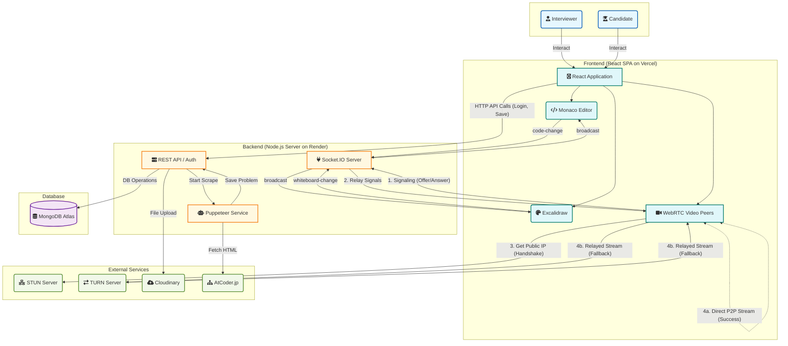

# JobSphere - The All-in-One Technical Interview Platform

JobSphere is a full-stack, real-time web application designed to streamline and enhance the technical interview process. It provides a collaborative environment where interviewers can create assessments, invite candidates, conduct live coding sessions, sketch out ideas on a shared whiteboard, and communicate via video call, all within a single platform.

## Key Features

**Dual User Roles**: Separate, secure portals and dashboards for Interviewers and Candidates.

**Live Collaborative Code Editor**: A real-time, multi-user code editor powered by Monaco Editor (the engine behind VS Code), allowing for a familiar and powerful coding experience.

**Real-time Collaborative Whiteboard**: A shared digital canvas utilizing the Excalidraw API, enabling users to draw diagrams, architect systems, and visualize concepts in real-time.

**Integrated Video Calling**: High-quality, peer-to-peer video communication powered by WebRTC for face-to-face interaction.

**Automated Problem Scraping**: Interviewers can add coding problems simply by pasting an AtCoder URL, with the backend scraping the details using Puppeteer.

**Secure Authentication & File Uploads**: Robust user authentication with JWTs and secure, cloud-based media uploads via Cloudinary.

# Tech Stack

JobSphere is built with the MERN stack and incorporates a variety of modern web technologies for real-time functionality.

| Category | Technology |
| :--- | :--- |
| **Frontend** |  **Monaco Editor, Excalidraw API** |
| **Backend** |   |
| **Database** |   |
| **Real-time** |   |
| **Other's** |     |


🏛️ Architecture & How It Works


### WorkFlow Diagram 


## Modulewise Working
### **1. Backend (Node.js / Express)**

The backend manages the RESTful API, database operations, and user authentication using JWTs in httpOnly cookies.

### **2. Real-Time Communication Layer**

This is the core of the collaborative experience, managed via Socket.IO rooms.

**a) Collaborative Editor**: Utilizes the Monaco Editor component on the frontend. User keystrokes emit code-change events via Socket.IO, which are broadcast to other users in the same room to synchronize the editor state.

**b) Collaborative Whiteboard:** Integrates the Excalidraw API on the frontend. As a user draws, the Excalidraw component emits scene data changes. These changes are sent over Socket.IO via a whiteboard-change event and broadcast to other room members, keeping the canvas in sync for all participants.

**c) Video Call (WebRTC):** Employs Socket.IO as a signaling server to orchestrate the peer-to-peer WebRTC connection handshake (offer/answer/ICE candidates) between clients.

### **3. Server-Side Automation (Puppeteer)**

The backend uses Puppeteer to run a headless Chromium instance, automating the scraping of problem data from AtCoder URLs to populate assessments , then using gemini api  to generate testcases for the problem.

## **⚙️ Environment Variables**

To run this project, you will need a .env file in the backend directory with your MONGO_URI, JWT_SECRET, GEMINI_API_KEY  and Cloudinary , SMTP.


## Getting Started Locally

1) Clone the repository.

2) Run  ``` npm install``` in both the frontend and backend directories.

3) Create and configure your ```.env``` file in the backend.

4) Run ```nodemon index.js (backend)``` and ```npm run dev (frontend)```.
